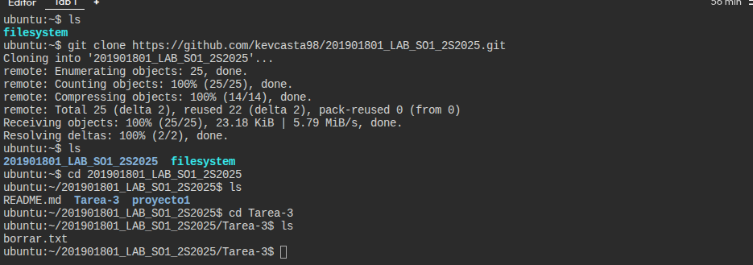
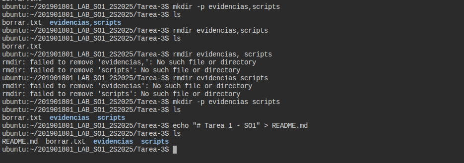
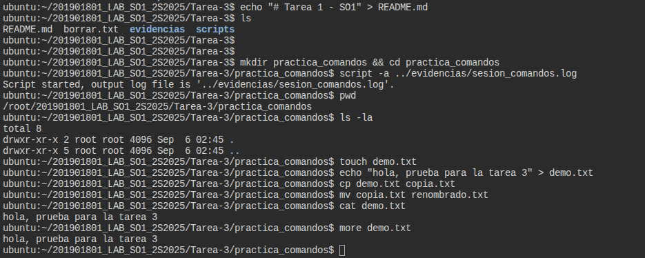
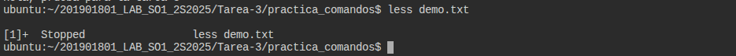
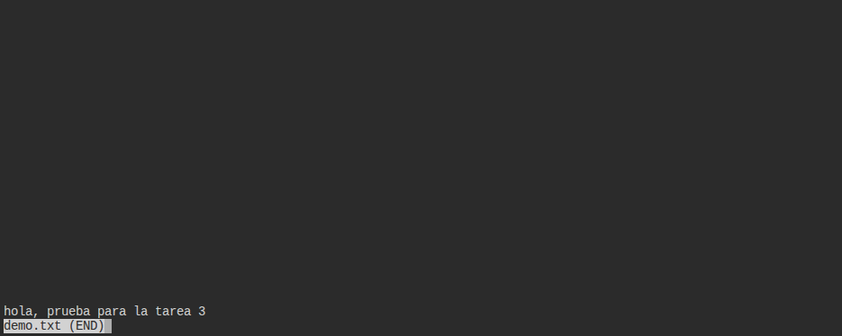
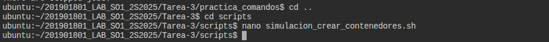
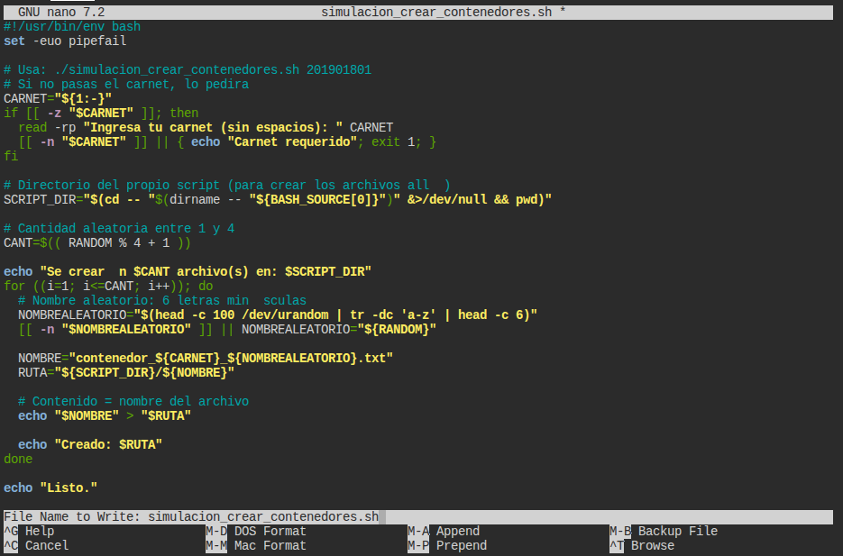
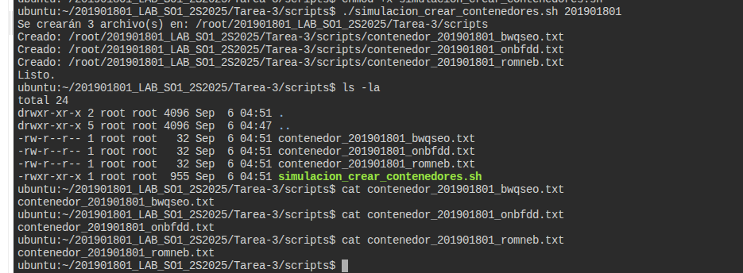

# Tarea 1 - SO1
## Kevin Eduardo Castañeda Hernández
## 201901801
---
### Para la realizacion de esta tarea hice uso de KillerKoda debido a problemas con mi computadora.
# Tabla de comandos utilizados
| Comando   | Descripción                                                                 | Ejemplo de uso                        |
|-----------|-----------------------------------------------------------------------------|---------------------------------------|
| `pwd`     | Muestra la ruta completa del directorio actual de trabajo.                  | `pwd` → `/home/usuario/tarea-1`       |
| `ls`      | Lista los archivos y carpetas del directorio actual.                        | `ls -la`                              |
| `cd`      | Cambia de directorio.                                                       | `cd scripts`                          |
| `touch`   | Crea un archivo vacío nuevo.                                                | `touch archivo.txt`                   |
| `cp`      | Copia archivos o carpetas.                                                  | `cp archivo.txt copia.txt`            |
| `mv`      | Mueve o renombra archivos o carpetas.                                       | `mv copia.txt renombrado.txt`         |
| `rm`      | Elimina archivos o carpetas.                                                | `rm archivo.txt`                      |
| `cat`     | Muestra el contenido completo de un archivo en pantalla.                    | `cat archivo.txt`                     |
| `more`    | Muestra el contenido de un archivo página por página (de arriba hacia abajo)| `more archivo.txt`                    |
| `less`    | Similar a `more`, pero permite moverse arriba y abajo en el contenido.      | `less archivo.txt`                    |
| `chmod`   | Cambia los permisos de lectura, escritura o ejecución de archivos/carpetas. | `chmod 755 script.sh`                 |
| `chown`   | Cambia el propietario y grupo de un archivo o carpeta.                      | `sudo chown usuario:grupo archivo.txt`|

--- 
# Capturas de pantallas de todo el proceso
## Clonar el repo a usar


## Borrar carpetas


## Comandos de navegacion, manipulacion, visualizacion y gestion de permisos de datos




## Creacion de archivo .sh



## codigo usado
```bash
#!/usr/bin/env bash
set -euo pipefail

# Usa: ./simulacion_crear_contenedores.sh 
# Si no recibe un, lo pedirá.
CARNET="${1:-}"
if [[ -z "$CARNET" ]]; then
  read -rp "Ingresa tu carnet (sin espacios): " CARNET
  [[ -n "$CARNET" ]] || { echo "Carnet requerido"; exit 1; }
fi

# Directorio del propio script (para crear los archivos allí)
SCRIPT_DIR="$(cd -- "$(dirname -- "${BASH_SOURCE[0]}")" &>/dev/null && pwd)"

# Cantidad aleatoria entre 1 y 4
CANT=$(( RANDOM % 4 + 1 ))

echo "Se crearán $CANT archivo(s) en: $SCRIPT_DIR"
for ((i=1; i<=CANT; i++)); do
  # Nombre aleatorio: 6 letras minúsculas
  NOMBREALEATORIO="$(head -c 100 /dev/urandom | tr -dc 'a-z' | head -c 6)"
  [[ -n "$NOMBREALEATORIO" ]] || NOMBREALEATORIO="${RANDOM}"

  NOMBRE="contenedor_${CARNET}_${NOMBREALEATORIO}.txt"
  RUTA="${SCRIPT_DIR}/${NOMBRE}"

  # Contenido = nombre del archivo
  echo "$NOMBRE" > "$RUTA"

  echo "Creado: $RUTA"
done

echo "Listo."
```
## Mostrar los archivos creados aleatoriamente junto con su contenido
